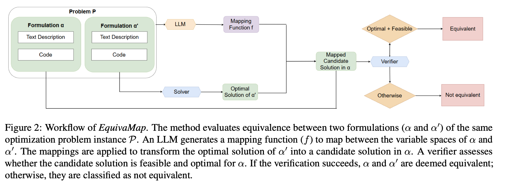

# EquivaFormulation

The dataset [EquivaFormulation](https://github.com/InCaseIDontCU/EquivaFormulation/blob/main/test.jsonl) is based on the dataset [NLP4LP](https://huggingface.co/datasets/udell-lab/NLP4LP), which conducts equivalent/nonequivalent transformations to optimization formulations.

## Variation Correspondence

For better interpretations of the variations, we summarize them in the following table:

| Variation ID | Variation Type         |Equivalent? |
|-------------|-----------------------|-----------------------|
| `_c`       | change the names of parameters and variables | Yes|
| `_d`       | binary substitution of the decision variables | Yes| 
| `_e`       | add valid inequalities  | Yes|
| `_f`       | substitute objective function with a constraint | Yes|
| `_g`       | add slack variables | Yes|
| `_h`       | linear substitution of the decision variables | Yes|
| `_i`       | re-scale the objective function | Yes|
| `_j`       | randomly assign a different formulation to the original problem| No|
| `_k`       | based on `_j`, change it to feasibility problem| No|
| `_l`       | loose active constraints at optimal | No|


# EquivaMap: Leveraging LLMs for Automatic Equivalence Checking of Optimization Formulations

This repository contains the code for our paper [EquivaMap: Leveraging LLMs for Automatic Equivalence Checking of Optimization Formulations](masked). Inspired by Karp reductions, in this work we introduce quasi-Karp equivalence, a formal criterion for determining when two optimization formulations are equivalent based on the existence of a mapping between their decision variables. We propose EquivaMap, a framework that leverages large language models to automatically discover such mappings, enabling scalable and reliable equivalence verification. To evaluate our approach, we construct the first open-source dataset of equivalent optimization formulations, generated by applying transformations such as adding slack variables or valid inequalities to existing formulations. 



## Step 0: Setup

To run the code, you need to install the following packages.
```
pip install openai
pip install subprocess
pip install glob
pip install json
pip install gurobipy
```

## Step 1: Data Preparation 

We construct [EquivaFormulation](masked) based on the [NLP4LP](https://huggingface.co/datasets/udell-lab/NLP4LP). The variations are labeled with different suffixes, which can be found on the Huggingface page.

## Step 2: Mapping Finding

The implementation of EquivaMap can be found in the `Evaluation/` folder.

To find the mapping between two formulations, you need to substitute your Openai API-key into the `mapping_finder_.py` file,
```
# Set your OpenAI API key
client = OpenAI(api_key='your-api-key')
```

and change the directory
```
# Base directory containing all the problems
base_dir = '/Users/stevenzhai/Desktop/MILP_data/sample-data-easy/'
```

into your local directory. 

## Step 3: Evaluation

To evaluate if the two formulations are equivalent to each other, you need to run the following files:

### Running the Optimization Scripts (`step1_subp.py`)

This script iterates over directories that match a specific pattern and executes the `optimus-code.py` scripts found in them. It ensures that all optimization models are run before proceeding to further steps. 

### Generating Constraint Mappings (`step2_map.py`)

This script processes directories containing the corresponding suffix (for example, _e) in their names. It reads `variable_mappings.json` and `solution.json` to construct a set of constraints, which are then saved to `map_constraints.py`.

### Integrating Mapped Constraints (`step3_map.py`)

This script updates `optimus-code.py` by inserting new constraints from `map_constraints.py`, saving the modified script as `optimus-code_e.py`.

### Running and Comparing Results (`step4_compare.py`)

This script executes `optimus-code_e.py` for each problem and compares the objective values from `solution.json` and `solution_e.json`. It categorizes results based on whether they match or differ.

By running these four steps, you can systematically evaluate whether two formulations yield equivalent results. Make sure you adjust the suffixes to the desired ones. 

We also include the data construction files, naive-LLM prompt files and WL-test construction files in the  `utils/` folder. 

## 🌟 Citation
Please cite the paper and star this repo if you use EquivaMap and find it interesting/useful, thanks! Open an issue if you have any questions.

```bibtex

```
